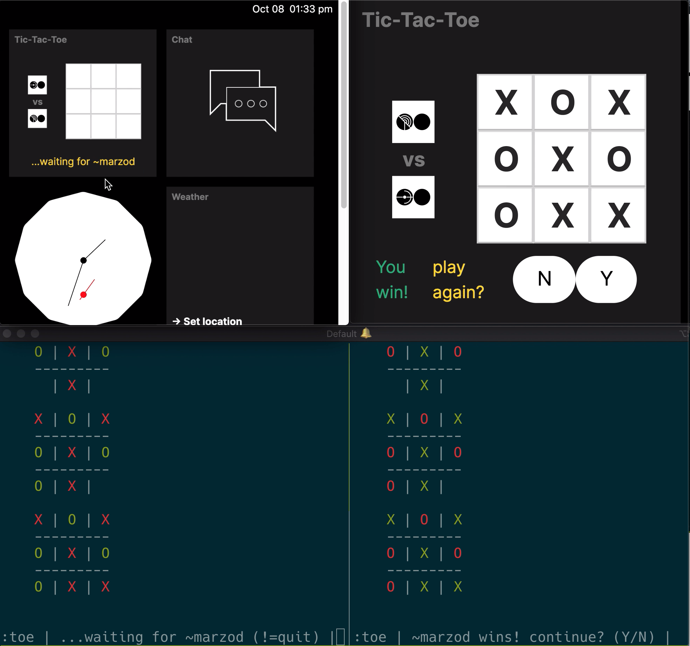
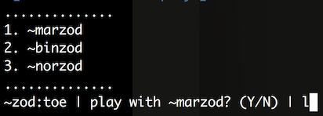

# TIC-TAC-TOE for Urbit

## Features

- Network multiplayer.
- Board state printed in the console.
- Notifications for incoming requests to play.
- Uses a list to keep track of incoming and outgoing subscriptions.
- Pending requests are queued and pulled after current game finishes.
- Styled text to print crosses and noughts on board, and game. notifications.
- Integration with Landscape.

## Installation

In order to run your application on your ship, you will need Urbit v.0.8.0 or higher. On your Urbit ship, if you haven't already, mount your pier to Unix with `|mount %`.

You have two options to mount the game into your pier:

- ##### `npm run build`

This builds your application and copies it into your Urbit ship's desk. In your Urbit (v.0.8.0 or higher) `|commit %home` (or `%your-desk-name`) to synchronise your changes.

- ##### `npm run serve`

Builds the application and copies it into your Urbit ship's desk, watching for changes. In your Urbit (v.0.8.0 or higher) `|commit %home` (or `%your-desk-name`) to synchronise your changes.

When you make changes, the `urbit` directory will update with the compiled application and, if you're running `npm run serve`, it will automatically copy itself to your Urbit ship when you save your changes (more information on that below).

## Playing

In your urbit's Dojo, run the command:

    ~your-urbit:dojo> |start %toe

The list of commands are:

- `'~ship-name'`: sends request to ~ship
  - Only if the prompt is `| shall we play a game?`
- `'!'`: cancels the current game. (if any, unqueues next subscription)
- `'l'`: list current subscriptions (any time during the game)
  - 
- `'1/1'`: board coordinates (`[1-3/1-3]`)
  - Only if the prompt is `| ~zod:[X] <- ~dev:[O] |`
- `'Y/y or N/n'`: confirm/reject request to play `[Y/N]`
  - Only if the prompt is:
    - `| ~zod wins! continue? (Y/N) |`
    - `| waiting for ~zod (!=quit) |`

A web frontend is also available on your Urbit's Lanscape.

## In Progress
- Code refactoring (frontend+backend)
- Follow [code style](https://urbit.org/docs/learn/arvo/style/)
- Remove old three/four letter variable names
- Use Hoon idioms
- Replace two-way subscription queue
- Heavy frontend refactor (follow React's best practices)
